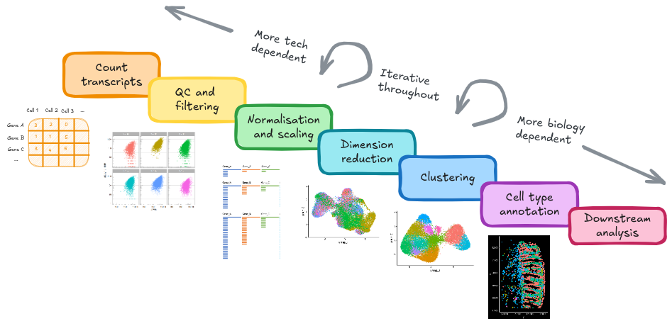
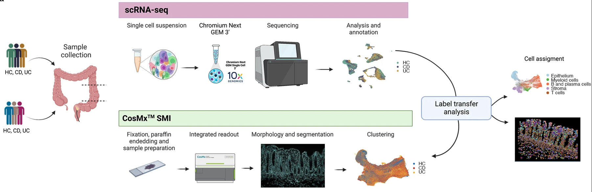
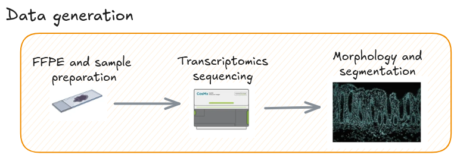
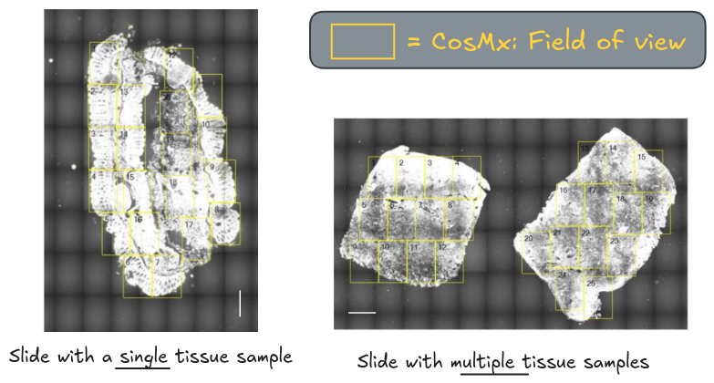
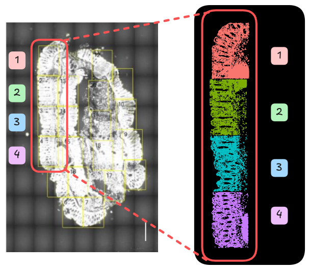
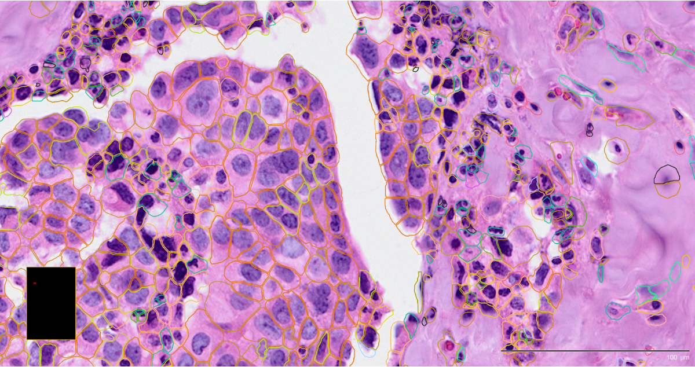
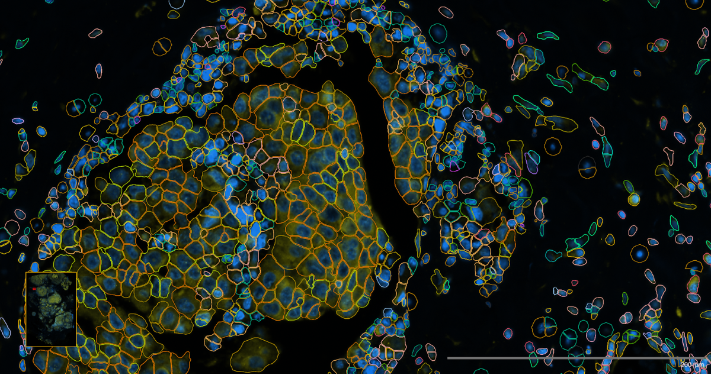

# Workshop and study overview

## Overview

In this workshop, you will be guided through the processing steps and analysis
of imaging-based spatially resolved transcriptomics (im-SRT) data. The steps
will be demonstrated using CosMx data, however, the steps and code can be
adapted to data generated by other im-SRT technologies. Whilst the concepts
are shared across different platforms, we will refer to differences when
applying the steps on Xenium data.

{width=100%}

## Study background   

This workshop will use CosMx Spatial Molecular Imager (SMI) data from the paper
_Macrophage and neutrophil heterogeneity
at single-cell spatial resolution in human inflammatory bowel disease_
(Garrido-Trigo et al. 2023)[^1].

[^1]: https://doi.org/10.1038/s41467-023-40156-6

This data set was chosen because the authors have made their raw and
annotated data available, along with the corresponding analysis
[code](https://github.com/HelenaLC/CosMx-SMI-IBD) and a browsable
[data interface](https://servidor2-ciberehd.upc.es/external/garrido/app/).

The study provides a clear biological contrast between health and disease
states. This disease cohort consists of donors with active **inflammatory bowel
disease (IBD)**, a chronic inflammatory condition of the gastrointestinal (GI) tract,
where **immune cell organisation within the tissue plays a central role in
disease pathogenesis.**

**Inflammatory bowel disease (IBD) is an umbrella term** that includes two
main GI tract disorders with different characteristics:  

- **Crohn's disease (CD)** 
- **ulcerative colitis (UC)**.

Spatial transcriptomic technologies enable gene expression to be measured at
subcellular resolution while preserving the tissue architecture, allowing
researchers to uncover spatial patterns and cell-cell interactions that would be
lost in conventional bulk or single-cell RNA-seq data. 

## The experimental design and cohorts

{width=100%}
_Fig 1a from Garrido-Trigo et al. (2023)._

The study included 9 CosMx slides of colonic biopsies, from a total of 9 donors:

| Cohorts                | Abbreviated | Number of samples |
| ---------------------- | ----------- | ----------------- |
| **Healthy controls**   | HC          | 3                 |
| Ulcerative colitis     | UC          | 3                 |
| **Crohn's disease**    | CD          | 3                 |

The study includes **three biological replicates per condition** (HC, UC, CD).
This **provides enough variation to capture differences between individuals** while
maintaining manageable data size for hands-on analysis.

In this workshop, **we will focus on the healthy control (HC)
and Crohn's disease (CD) samples.**

In the original paper, the CosMX SMI cells were annotated via label transfer from
the scRNA data. **The spatial transcriptomics data will be processed independent
of the scRNA data to demonstrate how differences in cellular composition and
spatial organisation can be inferred directly from the spatial CosMx data**.

## Data generation: slides, samples, and field of views

This section will provide an overview of the high-level data generation steps
that are conducted prior to any preprocessing or analysis steps. The steps begin
from sample preparation, to sequencing of field of views (FOVs) and cell
segmentation.

{width=100%}

### Sample preparation  

In imaging-based spatial transcriptomics (im-SRT) workflows, tissue samples
are prepared on slides. You may have a single, or multiple tissue samples per
slide. This study utilises both for the colonic tissue.

{width=100%}

## Sequencing  

In CosMx workflows, fields of views (FOVs) must be selected from the prepared
slides. These are the spatial areas where sequencing will be conducted.

This step allows you to be selective of the regions, such as those of most
importance to the research question or key hypotheses, and avoids sequencing
areas that do not contain any tissue. For example, in highly heterogeneous
tumour microenvironments, you can focus on selecting boundaries where 
infiltrated immune cells interact with cancerous cells.

:::{.rmdimportant}

**Xenium does not have FOVs**

Xenium uses a wide-field fluorescence microscope for automated image
acquisition across a larger, continuous imaging area. This approach allows
Xenium to map gene expression over the entire tissue region selected by the
user, rather than stitching together multiple small, distinct FOV images.

:::

For the workshop, you will be using a subset of FOVs - the first four FOVs from
each of the six samples.

{width=100%}

### Cell segmentation  

Cell segmentation is the computational step in imaging-based ST that
identifies the boundaries of individual cells so that RNA molecules can be 
correctly assigned to each one. These utilise the stained images to identify 
cell border shapes that are necessary for cell-level analyses downstream.

The following images are of **Xenium** using two different staining approaches,
H&E and DAPI respectively,
with the detected cell boundaries overlayed on both.

{width=100%}
{width=100%}

Accurate segmentation is essential because it determines how reliably
transcripts are assigned to individual cells, which directly affects
downstream analyses. Commercial platforms like CosMx and Xenium include on-machine
segmentation.

However, you may choose to re-run segmentation using independent tools such as
Cellpose (image-based) or Baysor (transcript-based or hybrid) to improve
boundary accuracy and adapt to specific tissue types.

:::{.rmdimportant}
TODO: add note on plotting H&E image - unavailable with this data.

- Need to import into stutility, which is not compatible with v5 Seurat
- https://satijalab.org/seurat/articles/spatial_vignette

:::

