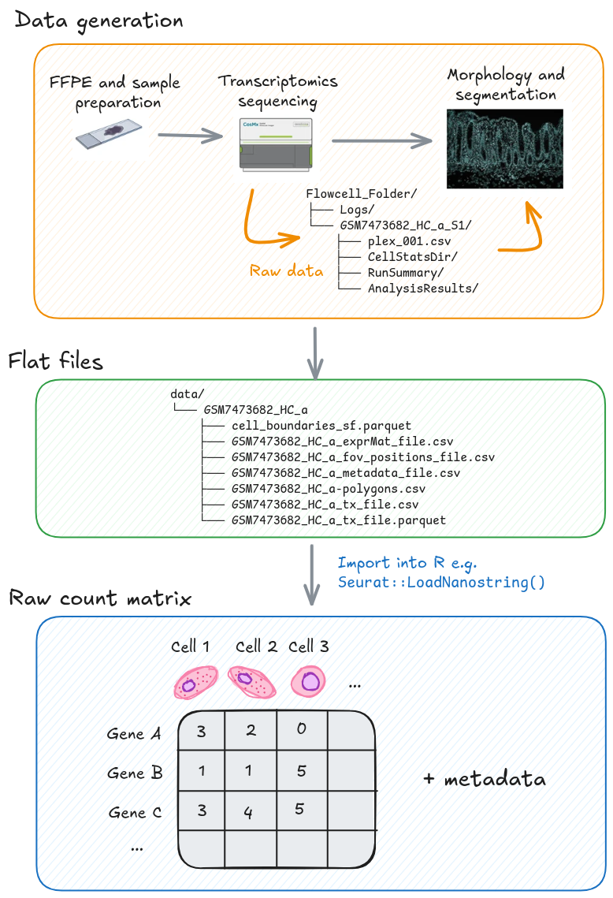

# Understanding our spatial data

## Learning objectives

## Overview

```{r include=FALSE}
knitr::opts_chunk$set(echo = TRUE)

library(Seurat)
library(SeuratObject)
library(tidyverse)
library(here)
```

Conducting processing and data analysis steps with open source, third-party
software/packages provides flexibility and supports a range of different
analyses. However, there are key steps undertaken before you can load your data
into R/Python.

## The raw data



The files generated by high-resolution spatial transcriptomics platforms, such 
as the CosMx Spatial Molecular Imager (SMI), are typically categorised based on
their processing stage. The **Raw Files** contain the primary output from the
instrument's run, necessary for decoding and spatial assignment, while the
**Flat Files** represent the aggregated, cell-level data ready for statistical
analysis in R or other environments.

### Raw files

The raw files represent the initial, large-volume data output directly from the
imaging instrument after the spatial transcriptomics experiment is complete.
This directory contains all the key imaging and log information required to
computationally process the raw fluorescent signals into **quantifiable transcript
locations and cellular boundaries**.

Key raw folders and files contain essential data used for **segmentation and
cell coordinate mapping**. For example, the `CellStatsDir/Morphology2D` folder
holds the images, including those generated from immunofluorescence staining
(e.g., DAPI, PanCK, CD45), which are vital inputs for cell segmentation, as the
**raw gene expression measurements are initially at the transcript level, not the 
cell level**.

Additionally, the `RunSummary/` directory contains the instrument configuration
files necessary for accurately converting image pixels into physical slide X-Y
coordinates.
  
| Folder / File Name              | Description                                                |
|---------------------------------|------------------------------------------------------------|
| `Flowcell_Folder/`              | Root directory containing logs and slide/run data          |
| `Logs/`                         | FOV coordinate files                                       |
| `GSM7473682_HC_a_S1/`           | Main data directory for slide `GSM7473682_HC_a`, slot 1    |
| `plex_001.csv`                  | Target probes metadata                                     |
| `CellStatsDir/`                 | Segmentation outputs (labels, overlays, morphology images) |
| `CellStatsDir/`                 | Location of high-resolution images                         |
| `RunSummary/`                   | Instrument configuration files (e.g. pixel–nm ratio)       |
| `AnalysisResults/`              | Processed analysis outputs (FOV summaries, detection limits, coordinates) |

Data retrieved from 
[CosMxDACustomModules](https://github.com/Nanostring-Biostats/CosMxDACustomModules/blob/main/Export/CosMxDAExportSetup.docx). 

### Flat files

:::{.rmdimportant}

**You do not need to access every one of these files!**

Most of what we need to do processing. Typically a directory of flat files is
read in as a whole, and we don't need to worry too much. But note there are no
images in here.

:::

The flat files contain the organised, post-processing outputs from a pipeline
(like AtoMx SIP) that are directly ready for loading into R packages such as
`Seurat`. 

These files come after cell segmentation, where the **single-molecule data are
summarised into count matrices at the single-cell level**. The main file, 
`SLIDE_exprMat_file.csv.gz`, contains the counts of genes per cell.

:::{.rmdimportant}

**A note on cell segmentation**

Cell segmentation is the computational step in sequencing-based ST that
identifies the boundaries of individual cells so that RNA molecules can be 
correctly assigned to each one. 

It uses nuclear (DAPI) and/or membrane stains to group transcript locations
into a cell-by-gene count matrix and cell border shapes (polygons) for
downstream analysis. 

Accurate segmentation is essential because it determines how reliably
transcripts are assigned to individual cells, which directly affects
downstream analyses. Commercial platforms like CosMx and Xenium include
segmentation in their processing pipelines.

However, you may choose to re-run segmentation using independent tools such as
Cellpose (image-based) or Baysor (transcript-based or hybrid) to improve
boundary accuracy and adapt to specific tissue types.
:::

Additionally, key metadata files are read in alongside the gene counts which
inform the spatial coordinates of FoVs (`SLIDE_fov_positions_file.csv.gz`), 
transcripts (`SLIDE_tx_file.csv.gz`), and segmented cell boundaries
(`SLIDE-polygons.csv.gz`).

| File name                         | Description                               |
|-----------------------------------|-------------------------------------------|
| `SLIDE-polygons.csv.gz`           | Cell borders                              |
| `SLIDE_exprMat_file.csv.gz`       | Counts of genes per cell (counts matrix)  |
| `SLIDE_fov_positions_file.csv.gz` | Location of FOVs on slide                 |
| `SLIDE_metadata_file.csv.gz`      | Cell-level QC metadata                    |
| `SLIDE_tx_file.csv.gz`            | Location of individual transcripts        |


:::{.rmdimportant}

**Xenium data**

For a Xenium slide there is just the one typical output directory; they discuss
the formats in the section on
[data archiving](https://www.10xgenomics.com/support/software/xenium-onboard-analysis/latest/analysis/xoa-output-archive-data),
but again, software tools take the directory as a whole.

:::

## Importing the flat files into R

When you load the processed, flat files into R

### Note on `Seurat::LoadNanostring()`

Load the libraries required for this step.

To load the data, we can use the `Seurat::LoadNanostring()` function. However,
this default method drops most of the metadata in the Seurat object. For example,
what field of view (FoV) each cell a member of is missing. 

We provide an alternate function. In time, this should be fixed within Seurat.
See comments [here](https://github.com/satijalab/seurat/discussions/9261)

```{r eval=F}
source(here("scripts/LoadNanostring_edited_function.R"))
example_path <- here("raw_data", "GSM7473682_HC_a")
example_so <- LoadNanostring(example_path, assay='RNA', fov="GSM7473682_HC_a")
```

```{r eval=F}
example_so
```

```console
An object of class Seurat 
999 features across 42045 samples within 1 assay 
Active assay: RNA (999 features, 0 variable features)
 1 layer present: counts
 1 spatial field of view present: GSM7473682_HC_a
```

## Loading all samples from raw data

We use a subsampled data for this workshop, for three healthy control samples (HC)
and three Crohn's disease samples (CD).

The first four field of views are used.

```{r, eval=F}
# How was this created?
seurat_file_00_raw <- here("data", "GSE234713_CosMx_IBD_seurat_00_raw.RDS")
so_raw_full <- readRDS(seurat_file_00_raw)
so_raw_subset <- so_raw_full[, so_raw_full$group %in% c("CD", "HC") & so_raw_full@meta.data$fov <= 4]
saveRDS(so_raw_subset, here("data", "GSE234713_CosMx_IBD_seurat_00_raw_subsampled.RDS"))
```

## Loading the workshop data

TODO: Add image for all FOVs, and outline the ones we are using

```{r}
so_path <- here("data", "GSE234713_CosMx_IBD_seurat_00_raw_subsampled.RDS")
so <- readRDS(so_path)
```

### Understanding the `SeuratObject`

:::{.rmdnote}

**Why Seurat?**

Seurat objects are a data structure to store the count data and additional metadata.
As the data is very high dimensional, it is important
that connected information about cells, samples, and data stay connected
during data analysis.

Other frameworks such as `scverse`, and data classes like `anndata` and 
`SpatialFeatureExperiment` represent the data differently, but all meet the
needs above. Differences in compatibility with other tools.

Flexibility across single-cell transcriptomics.
:::

Display the Seurat object.

```{r}
so
```

**999 features across 68624 samples with 2 assays**

- 980 genes + 19 negprobes
- 68k number of segmented cells analysed
- two different types of measurements, detailed below

**Active assay: RNA (980 features, 0 variable features):**

- RNA assay: Primary gene expression measurement data (counts)
- 980 transcripts measured
- no variable features as feature selection has not been conducted yet

**6 layers present: counts.GSM7473682.HC.a, counts.GSM7473683.HC.b, 
counts.GSM7473684.HC.c, counts.GSM7473688.CD.a, counts.GSM7473689.CD.b, 
counts.GSM7473690.CD.c**

- Each layer represents a sample from either HC or CD donors. Required for
comparison of both groups downstream

**1 other assay present: negprobes**

This secondary assay specifically stores the counts corresponding to negative
control probes. In spatial transcriptomics, tracking these control probes is
crucial for quality control, specificity assessment, and defining background
signal.

**6 spatial fields of view present: GSM7473682.HC.a GSM7473683.HC.b GSM7473684.HC.c GSM7473688.CD.a GSM7473689.CD.b GSM7473690.CD.c:**

The list of six spatial fields of view (FOVs) explicitly links the spatial/image
information stored in the Seurat object to the six specific samples/layers
identified above. This demonstrates that the data set is ready for spatially
resolved analysis and visualisation, allowing results (like cell clusters or
gene expression) to be mapped back onto the original tissue sections for all
six integrated samples.

:::{.rmdimportant}

**CosMX sample names**

Note that the field of view names are delimited by `.`. At the time of writing,
underscores will cause some functions to fail silently. For more information,
see [this issue](https://github.com/satijalab/seurat/issues/10103)

Xenium does not have FoVs.

- TODO: expand  

:::

Display the metadata

```{r}
head(so@meta.data)
```

| Column         | Definition                                 |
| -------------- | ------------------------------------------ |
| Row name       | The sample and cell                        |
| `orig.ident`   | Sample                                     |
| `nCount RNA`   | The number of sequenced transcripts        |
| `nFeature_RNA` | The number of transcripts mapped to a gene |

Each sample should be annotated with its experimental details. This is important
so we know which groups to compare downstream, i.e. case vs. control comparison.
This particular study has one sample per slide (easy!), but there are typically
more. 

TODO: Explain input data, what it represents, how it will be used for analysis.

TODO: Define terms like centroids, segments, fov

- See: https://satijalab.org/seurat/articles/seurat5_spatial_vignette_2#mouse-brain-vizgen-merscope
- TODO: Excalidraw of these

Display the metadata columns:

```{r}
names(so@meta.data)
```

There is a lot of information. Use something like skimr for EDA and to
understand each field at a glance

```{r}
skimr::skim(so@meta.data)
```

Explain: number of rows (68624) represents a cell

Identify important metadata columns and discuss what they mean

This dataset is a subset of the experimental data - only the first 4 fovs of
each, and only the CD and HC sample groups. 

seurat fov = slide
bruker cosmx fov = region on slide

View the `tissue_sample` metadata to prepare for the next step. This represents


```{r}
table(so$tissue_sample)
```

## Visualising our spatial data

Visualise clusters in a spatial context

```{r}
table(so$orig.ident)
```

```{r, fig.height=8}
hc_idents <- unique(so$orig.ident)[1:3]
cd_idents <- unique(so$orig.ident)[1:3]
ImageDimPlot(so, fov = hc_idents, group.by = "fov_name", axes = T)
```

```{r, fig.height=8}
hc_idents <- unique(so$orig.ident)[1:3]
ImageDimPlot(so, fov = hc_idents, group.by = "fov_name", axes = T)
```

```{r, fig.height=8}
cd_idents <- unique(so$orig.ident)[4:6]
ImageDimPlot(so, fov = cd_idents, group.by = "fov_name", axes = T)
```

By an individual gene.

Do not need fov_name this time

```{r, eval=F}
ImageFeaturePlot(so, fov = "GSM7473682.HC.a", features = "S100A6")
```
```console
Warning: No layers found matching search pattern provided
Warning in FetchData.Assay5(object = object[[DefaultAssay(object = object)]],  :
  data layer is not found and counts layer is used
```

Cannot use `ImageFeaturePlot` yet, without normalisation, dim red etc.

## Count data (`assays`)

Where are my counts?

TODO: Excalidraw flowchart of assays

```{r}
so@assays
```

### Gene expression count matrices

```{r}
so@assays$RNA$counts.GSM7473682.HC.a[1:5,1:5]
```

Row = gene

Column = cell for the sample

### Negative probes

Explain that negprobes are negative controls to see how noisy your data is.
These do not bind to anything etc.

```{r}
so@assays$negprobes
```

```{r}
rownames(so@assays$negprobes)
```

19 different negative probes.

```{r}
so@assays$negprobes[1:5, 1:5]
```

In the next lesson, 
