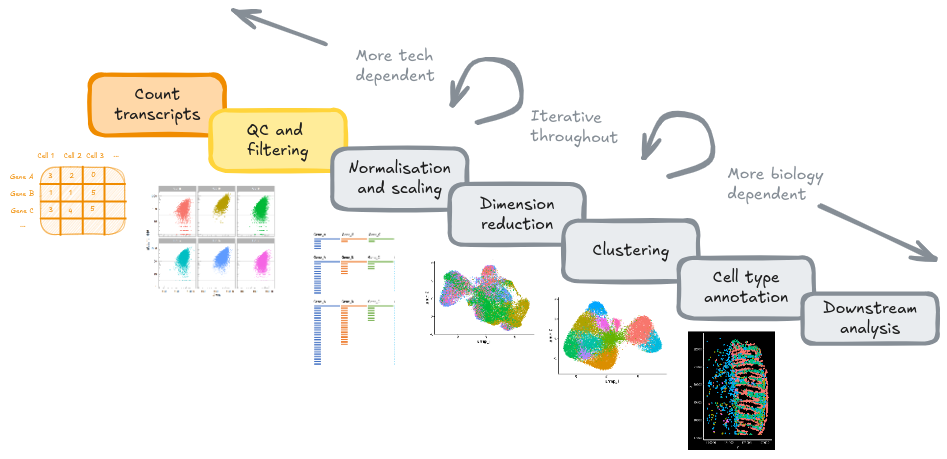
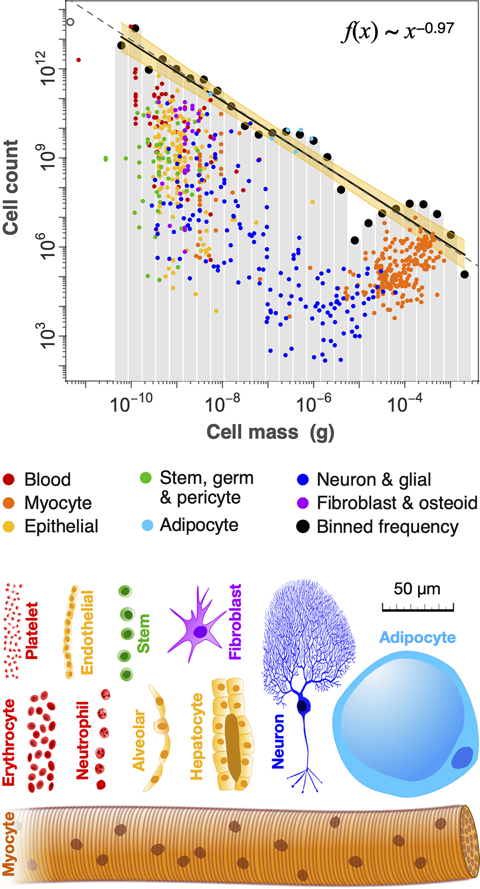

# Quality control and filtering

{width=100%}

## Goals

- Explore common quality control (QC) metrics used in spatial transcriptomics, 
such as total transcript counts, detected genes, cell area, and negative probe 
percentages  
-	Understand potential sources of technical artefacts (e.g. segmentation errors,
low RNA capture, or border effects)
- Use negative control probes to quantify background noise in im-SRT data
- Select and justify appropriate sample-specific filtering thresholds for QC
metrics

## Overview

Quality control is a key step at the beginning of any bioinformatics processing
pipeline. Understanding the potential sources of bias introduced during the data
generation steps is key in helping interpret the results of downstream data
processing steps.

```{r}
knitr::opts_chunk$set(
  echo = TRUE,
  warning = FALSE
)

# load libraries for this step
library(Seurat)
library(tidyverse)
library(here)
```

Read in subsampled seurat object.

```{r}
# Read in the subsampled data for this lesson
so_path <- here("data", "GSE234713_CosMx_IBD_seurat_00_raw_subsampled.RDS")
so <- readRDS(so_path)
```

## Identifying potential technical artefacts

Library size (total transcripts) and cell areas are good indicators of technical
artefacts introduced during data generation steps. 

Possible artefacts can include:

- Low quality cells  
- Cell segmentation challenges (combining two cells, not aligned with real cell
boundaries, leading to high cell area and low RNA count)  

Understanding how these are prevalent in your data can help with biological
interpretation downstream. For example, discerning whether differences in cells
are due to e.g. cell type differences, or technical artefacts.

We will first view the library size and cell area distributions on their own.

### Library size (transcript counts)

```{r warning=F}
ggplot(so@meta.data, aes(x = nCount_RNA, col = tissue_sample)) +
  geom_density() +
  scale_x_log10() +
  theme_bw() +
  annotation_logticks(sides = "b", colour = "lightgrey") +
  ggtitle("Transcript counts per cell")
```

The transcripts per cell all display a log-normal distribution with shifting medians.

Indicates no largely low-quality cells, and a good example of library size 
effects that should be normalised downstream, prior to analyses.

### Cell surface area

```{r warning=F}
# Total counts per cell
ggplot(so@meta.data, aes(x=Area, col=tissue_sample)) +
  geom_density() +
  scale_x_log10() +
  theme_bw() +
  annotation_logticks(sides = "b") +
  ggtitle("Area (px^2) per cell")
```

Areas also follow log-normal distributions with medians ranging between 3,000 -
4,000px^2. Sample/FOV `CD.c` has slightly smaller cell area with a median
of ~2,000px^2.

## Bivariate QC

The next plot compares total transcript counts (nCount_RNA) with the number of
detected genes (nFeature_RNA) for each sample. The strong positive relationship
indicates that most captured transcripts are successfully mapped to known genes,
reflecting good data quality and sound probe hybridisation.

Only a small subset of cells deviates from this trend - typically those with low total counts. This suggests low-quality cells in the tissue sample, rather than widespread technical artefacts.

```{r}
so@meta.data %>%
  ggplot(aes(x = nCount_RNA, y = nFeature_RNA, colour = tissue_sample)) +
  geom_point(alpha = 0.4, size = 0.1) +
  facet_wrap(~tissue_sample) +
  theme_light() +
  theme(legend.position = "none")
```

:::{.rmdimportant}

**Accounting for variation in cell sizes**

Cautious of samples with highly variable varying sizes. Total transcript
counts and cell areas can vary substantially. Applying "standard" QC or
filtering thresholds uniformly across all cells may remove valid cells.

{width=90%}  

_Fig 3. from Hatton et al. (2023): Distribution of cell mass (g) across different cell types._
:::

The following plot shows the relationship between the total transcript counts
(nCount_RNA) and cell area across samples. In all tissue samples (Seurat FOVs),
larger cells generally contain more transcripts, forming a positive log-log
correlation.

However, some samples (`HC.a`, `HC.c`, `CD.a`, `CD.c`) display greater
variability and a subset of small, high-transcript cells, which may indicate 
segmentation artefacts or biological differences such as the presence of smaller immune cells.

```{r, warning=F}
ggplot(so@meta.data, aes(x=Area, y=nCount_RNA, colour=tissue_sample)) +
  geom_point(size = 0.1, alpha = 0.4) +
  scale_x_log10() +
  scale_y_log10() +
  annotation_logticks(sides = "bl") +
  facet_wrap(~tissue_sample) +
  annotation_logticks(colour = "lightgrey") +
  theme_light()
```

## Filtering low-quality cells

### Negative probes as an indicator of noise  

Spatial transcriptomics assays include both RNA-specific probes, and negative
control probes (or, background probes). While RNA specific-probes hybridise to
specific targets, negative probes do not bind to anything. Their primary purpose
is to quantify and account for this technical noise and non-specific signal.

In this step, we will calculate the proportion of negative control probes
relative to the total counts (RNA) for each cell. Cells exhibiting a high
percentage of noise (i.e., high proportion of negative probe counts) can be
flagged and removed during the QC stage.

Key metrics to add to the Seurat object:

- `so$percent_neg`: The percentage of negative probes per cell
- `so$mean_neg`: The average negative probes per cell

```{r}
so$percent_neg <- (so$nCount_negprobes / (so$nCount_RNA + so$nCount_negprobes)) * 100

# Join layers to calculate average_neg
so@assays$negprobes <- JoinLayers(so@assays$negprobes)
so$mean_neg <- colMeans(so@assays$negprobes) # Only defined first sample
```

The bar plot shows that some samples (CD_b, CD_c, and HC_b) have higher
average negative probe counts, suggesting variable levels of noise across
slides.

```{r}
so@meta.data %>%
  ggplot(aes(x = tissue_sample, y = mean_neg, colour = tissue_sample)) +
  geom_col() +
  theme_light()
```

However, displaying summary metrics alone, such as the average may not
capture the variation in the data, or may be skewed. The density plot illustrates that most cells
across all samples have low levels of background signal, as indicated by the small proportion of negative
probes (medians across all samples < 2%). While overall data quality
appears high, minor shifts suggest minimal between-sample variation.

```{r}
so@meta.data %>%
  ggplot(aes(x = percent_neg, colour = tissue_sample)) +
  geom_density() +
  scale_x_log10() +
  theme_light() +
  annotation_logticks(sides = "b", colour = "lightgrey")
```

```{r}
# Discuss difference with Xenium - xenium lower counts, lower background.
ggplot(so@meta.data, aes(y=mean_neg, x=nCount_RNA)) +
  geom_point(pch=3, alpha=0.1) +
  scale_x_log10() +
  theme_bw() +
  ggtitle("Negative probes vs counts")

ggplot(so@meta.data, aes(y=percent_neg, x=nCount_RNA)) +
  geom_point(pch=3, alpha=0.1) +
  scale_x_log10() +
  coord_cartesian(ylim = c(0, 10)) +
  facet_wrap(~tissue_sample) +
  theme_bw() +
  ggtitle("Negative probes vs counts")
```

```{r}
min_ncount_rna <- 90
max_percent_neg <- 2
```

```{r}
ggplot(so@meta.data, aes(y=percent_neg, x=nCount_RNA)) +
  geom_point(pch=3, alpha=0.1) +
  geom_hline(yintercept = max_percent_neg, lty=3, colour = "red") +
  geom_vline(xintercept = min_ncount_rna, lty=3, colour = "red") +
  scale_x_log10() +
  coord_cartesian(ylim = c(0, 21)) +
  facet_wrap(~tissue_sample) +
  theme_bw() +
  ggtitle("Negative probes vs counts")
```

### Identifying filtering thresholds

```{r}
# Apply a filter
so@meta.data <- 
  so@meta.data %>%
  mutate(
    qc = if_else(nCount_RNA >= min_ncount_rna & percent_neg <= max_percent_neg, "Keep", "Remove")
  )

table(so$qc, so$orig.ident)
```

Nearly 50% of the cells for HC.c will be filtered out, display which cells will
be removed.

```{r}
ImageDimPlot(so, fov = "GSM7473684.HC.c", group.by = "qc")
```

The stromal compartment will be removed entirely and can be difficult for
co-localisation analyses. Further, the epithelial compartment in the bottom left
FOV is very patchy.

:::{.rmdnote}

## ACTIVITY: Identifying your own filtering thresholds

TODO: Hide this block, summarise into tips/hints

You have seen an example where stringent filtering omits key cells or
compartments.

Identify a suitable threshold for `min_ncount_rna` and `max_percent_neg` by
iteratively:

1. Changing the thresholds for `min_ncount_rna` and `max_percent_neg`
2. Displaying the bivariate distribution of `nCount_RNA` and `percent_neg` per
tissue sample
3. Using `ImageDimPlot` to visualise which cells are removed

```{r}
min_ncount_rna <- 70
max_percent_neg <- 4
```

```{r}
ggplot(so@meta.data, aes(y=percent_neg, x=nCount_RNA)) +
  geom_point(pch=3, alpha=0.1) +
  geom_hline(yintercept = max_percent_neg, lty=3, colour = "red") +
  geom_vline(xintercept = min_ncount_rna, lty=3, colour = "red") +
  scale_x_log10() +
  coord_cartesian(ylim = c(0, 21)) +
  facet_wrap(~tissue_sample) +
  theme_bw() +
  ggtitle("Negative probes vs counts")
```

```{r}
so@meta.data <- 
  so@meta.data %>%
  mutate(
    qc = if_else(nCount_RNA >= min_ncount_rna & percent_neg <= max_percent_neg, "Keep", "Remove")
  )

table(so$qc, so$orig.ident)
```

```{r}
# Epithelial compartment less patchy, but still hard to retain the stromal cells
# These are the trade-offs to consider
ImageDimPlot(so, fov = "GSM7473684.HC.c", group.by = "qc")
```

```{r}
# A lot of cells marked for removal and a bit patchy
ImageDimPlot(so, fov = "GSM7473688.CD.a", group.by = "qc")
```
:::

### Applying the filter

For the purposes of the workshop, we will all use the same threshold.

```{r}
min_ncount_rna <- 70
max_percent_neg <- 4
```

```{r}
so_filtered <- subset(so, qc == "Keep")
table(so_filtered$orig.ident)
```

```{r eval=F}
saveRDS(so_filtered, file = here("data", "GSE234713_CosMx_IBD_seurat_02_rna70_neg4.RDS"))
```

## Field of View QC (CosMX only; Advanced)

Good to check library sizes across FOVs - red flags include FOVs with close to
no cells.

```{r}
so@meta.data %>%
  unite(col = unique_fov_names, orig.ident, fov, remove = F) %>%
  ggplot(aes(x = nCount_RNA, col = orig.ident, group = unique_fov_names)) +
  geom_density() +
  scale_x_log10() +
  theme_light() +
  annotation_logticks(sides = "b")
```

TODO: As well as border effects. Run per sample.

```{r, eval=F}
# For each cell, calculate the distance between the centroid to each FOV border
so_borders <- so@meta.data %>%
  group_by(tissue_sample, fov) %>%
  mutate(
    top = max(CenterY_local_px) - CenterY_local_px,
    bottom = CenterY_local_px - min(CenterY_local_px),
    left = CenterX_local_px - min(CenterX_local_px),
    right = max(CenterX_local_px) - CenterX_local_px
  ) %>%
  select(top, bottom, left, right, nCount_RNA, tissue_sample) %>%
  pivot_longer(cols = -c(nCount_RNA, tissue_sample), names_to = "fov_direction", values_to = "distance") 

so_borders %>%
  ggplot(aes(x = distance, y = nCount_RNA)) +
  geom_point(size = 0.1, alpha = 0.4) +
  facet_wrap(~fov_direction, ncol = 4) +
  scale_y_log10() +
  theme_light() +
  geom_smooth(method = "loess", span = 0.2)
```

## Summary

Quality control (QC) in spatial transcriptomics is a highly iterative and
context-dependent process. It requires continual exploration of your data rather
than following a prescriptive set of rules. When examining and filtering your
data for the first time, we recommend setting permissive threshold so
meaningful cells are not removed. After a preliminary look at the data, QC steps
can be revisited.

In comparison to older transcriptomics technologies, spatial technologies introduce
new sources of technical variation that can make interpretation of your results
tricky, and even obscure true, biological signals in the data. While you do not
need to filter in every step, it is useful to understand these potential sources
of bias, and inform subsequent rounds of QC.

Sources of technical variation are also platform dependent and should be
accounted for. For example, CosMx contains FOVs which adds another dimension,
compared to Xenium.

Quality control is not a step you conduct once during a pre-processing pipeline.
Throughout the following steps in the workshop, you will continue to conduct QC
steps.
