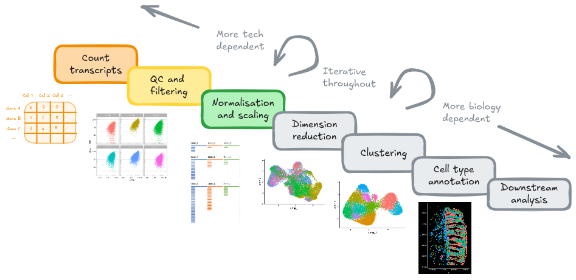
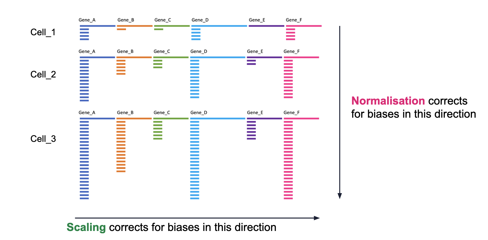

# Normalisation and scaling

{width=100%}

## Goals

- Correct for biases across cells and gene expression values
- Understand the trade-offs between normalisation methods
- Identify the most variable genes in preparation for dimensionality reduction  

## Overview

Normalisation and scaling are important processing steps when analysing 
transcriptomics data, particulary for single-cell RNA sequencing (scRNA-seq) 
and spatial transcriptomics (ST). They serve different purposes but both aim
to adjust technical variation so that cells are comparable. This is important for accurate clustering and analysis tasks. 

Goal: capture biology.

1. **Normalisation:** Different cells have different total target counts. Normalisation allows them to be comparable.  
2. **Identification of highly variable features (feature selection)**  Identifying the most variable features allows retaining the real biological variability of the data and reduce noise in the data.  
3. **Scaling the data**: Highly expressed genes can overpower the signal of other less expressed genes with equal importance. Within the same cell the assumption is that the underlying RNA content is constant. 

{width=100%}

## Selecing a normalisation approach

The choice of normalisation method can have a big impact on the biological
interpretation of your downstream analysis steps. Therefore, it is important
to consider selecting a suitable approach based on your data, and the questions
you want to answer.

Unlike scRNA-seq, where cells are treated as independent observations, ST data 
have spatial patterns that need to be accounted for that scRNA-seq 
normalisation misses. These patterns include probe capture performance,
differences in cell morphology and heterogeneous tissue architecture.

Other sources include gene panel skew.

:::{.rmdimportant}

**Recommendations**

Trade-off between simplicity and performance of methods.

| Method                         | Pros                                                          | Cons                                                                                         |
| ------------------------------ | ------------------------------------------------------------- | ---------------------------------------------------------------------------------------- |
| Spatially-aware (SpaNorm)      | Recommended - accounts for spatial dependent patterns         | Computationally demanding and requires several parameter tuning steps                    |
| Cell volume/area normalisation | Alternative for spatially-aware methods                       | Requires accurate area or volume data, bad cell segmentation = bad normalisation, manual |
| Log-normalisation              | Easy to run, incorporated in many intermediate processing pipelines, used for analyses that require "minimal" normalisation | Does not account for spatial patterns                                                    |
| scTransform                    | Powerful for scRNA-seq                                        | Avoid for ST - over-corrects spatial patterns                                            |
| Library size normalisation     | Simple                                                        | Avoid, problematic overall                                                                                    |

For a more in-depth discussion of normalisation in ST data sets and benchmarks,
refer to the following resources:  

- [OSTA](https://lmweber.org/OSTA/pages/ind-normalization.html)
[Atta et al. (2024)](https://genomebiology.biomedcentral.com/articles/10.1186/s13059-024-03303-w)
- [Bhuva et al. (2024)](https://genomebiology.biomedcentral.com/articles/10.1186/s13059-025-03565-y)
:::

```{r echo=FALSE, results='hide', warnings=FALSE}
library(Seurat)
library(tidyverse)
library(here)

so <- readRDS(here("data", "GSE234713_CosMx_IBD_seurat_02_rna70_neg4.RDS"))
```

<!-- CHCEK IF FINAL OBJEWCT IS SPLIT BY NOW -- Start by 'splitting' the object so that each sample has its own assay again.  -->

<!-- ```{r  results='hide', warnings=FALSE} -->
<!-- # Basic preprocessing -->
<!-- # Split layers out again -->
<!-- # https://satijalab.org/seurat/articles/seurat5_integration -->
<!-- #so <- split(so, f = so$orig.ident) -->
<!-- ``` -->

Inspect current RNA assay. Layers are `counts.*` for each sample/FOV.

```{r}
so@assays$RNA
```

We will use the 'LogNormalize' method in Seurat - as described in the NormaliseData function help:

> "LogNormalize: Feature counts for each cell are divided by the total counts for that cell and multiplied by the scale.factor. This is then natural-log transformed using log1'"


```{r message=FALSE}
so <- NormalizeData(so, assay = "RNA", normalization.method = "LogNormalize")
```

When displaying the RNA counts assay again, note that there are new
`data` layers. These represent our (log-)normalised data.

```{r}
so@assays$RNA
```

:::{.rmdimportant}

**Choosing a normalisation method is context-dependent**

Normalise: 

- For dimensionality reduction and clustering  
- Integration and batch correction  
- Cell annotation, label transfer

**Minimally normalised** counts:

Where raw transcript counts are required or apply their own
normalisation method. Used to preserve spatial trends
that normalisation can remove e.g.

- Identifying spatially variable genes - Moran's I
- Reporting gene expression values across cells

This is why it is important to store both the `counts` and `data`
layers in your data object.
:::

## Identifying highly variable genes (HVGs)

{width=100%}

Which genes vary between cell types/states in our sample? 

We don't yet know anything about celltypes or stats, but we can make the assumption that the genes with high variance and are probably reflecting some biological state. In contrast a 'housekeeper' gene with even expression across all cell types won't be helpful in grouping our cells. 

Because we have our data split by sample, Seurat will identify variable genes within each sample and combine that information. From the [Seurat5 documentation on layers](https://satijalab.org/seurat/articles/seurat5_integration#layers-in-the-seurat-v5-object): 

> "Note that since the data is split into layers, normalization and variable feature identification is performed for each batch independently (a consensus set of variable features is automatically identified)."


```{r message=FALSE}
so <- FindVariableFeatures(so, nfeatures = 200)
```


Each point represents one gene - the red ones are our top 200 'highly variable genes' or HVGs. There is no firm rule on how many HVGs we want. For a whole transcriptome that could be 2000, for a 1000 genes we have 200. The exact number doesn't matter so much; so long as we capture the genes above the main group of low variance genes.

```{r}
VariableFeaturePlot(so)
```

We can list those genes:

```{r}
head(VariableFeatures(so))
```

## Scale data

By default, the scaleData function will scale only the HVGs.

```{r message=FALSE}
so <- ScaleData(so) # Just 200 variable features
```

Note the presence of the single 'scale.data' layer.

```{r}
so
```


Save the object

```{r eval=F}
saveRDS(so, file = here("data", "GSE234713_CosMx_IBD_seurat_03_normalised.RDS"))
```


