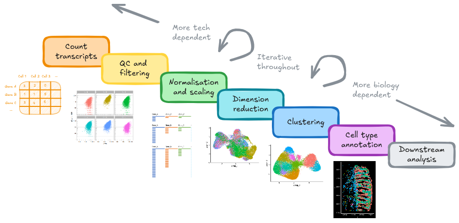
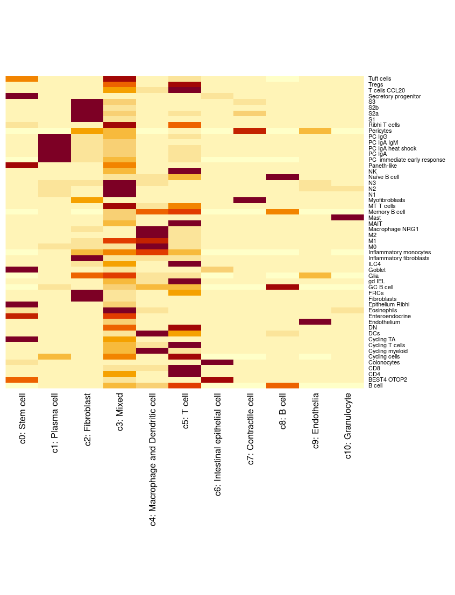

# Clustering Labeling{#ClusterLabelling}

{width=100%}

Classifying cells into meaningful celltypes (or cell states) is a time consuming, but extremely important, part of a spatial analysis.

It may involve pulling together multiple lines of evidence to assign celltype labels to cluster labels. Some approaches outlined below:


## Cluster Markers

Considering our clusters - lets find some more meaningful labels than 1-10! What genes are expresses specifically in each of these clusters?

```{r message=FALSE, warning=FALSE}
DimPlot(so, group.by='seurat_clusters')
```


The 'FindAllMarkers' function runs a differential expression test to see what genes are expressed differently between each celltype and the rest of the experiment. The 'only.pos' parameter is useful to report only genes enriched (not absent) in each cluster. 


```{r message=FALSE, warning=FALSE}
# Need to join the layers back again for this.
so <- JoinLayers(so)
marker_table <- FindAllMarkers(so, group.by='seurat_clusters', only.pos=TRUE)
```

Now we have a list of 'marker' genes. They're not markers in the sense of canonical celltype markers - they're just defined from the data.

* Look at those p-values! They're extremely significant because each cell is treated as a replicate (and samples are ignored). 
* We can filter on fold-change (avg_log2FC) of expression to emphasise more interesting larger change (as even very small difference can be significant, but not useful for determining cell types). 

The [human protein atlas](https://www.proteinatlas.org/) is a useful site to look up the single cell RNA expression of a given gene; e.g. [CD37](https://www.proteinatlas.org/search/CD37)


```{r}
DT::datatable(marker_table)
```
A dot plot is a convenient way to summarise the top few distinct genes. It can let you read off some obvious celltypes and see similarities between clusters.

```{r message=FALSE, warning=FALSE}    
# Get top 3 genes per cluster, with log FC > 1
marker_table_top <- marker_table %>%
    group_by(cluster) %>%
    dplyr::filter(avg_log2FC > 1, p_val_adj < 0.01) %>%
    slice_head(n = 3)

DotPlot(so, features = unique(marker_table_top$gene)) + theme(axis.text.x = element_text(angle = 90, vjust = 0.5, hjust=1))
```


<!-- Plot cluster specific genes on a heatmap on a subset of 5000 cells. -->
<!-- ```{r message=FALSE, warning=FALSE}     -->
<!-- #DefaultLayer(so[['RNA']]) <- 'data' -->
<!-- so.mini <- so[, sample(colnames(so), size =5000, replace=F)] -->
<!-- DoHeatmap(so.mini, assay='RNA', features = marker_table_top$gene)  -->

<!-- ``` -->


You can get some more information form these marker lists by dropping them into a tool like [enrichr](https://maayanlab.cloud/Enrichr/enrich) and considering cell type enrichment.
NB: enrichR also has a R package, and could be done programatically 

```{r}
top_marker_genes <- filter(marker_table, cluster == "1") %>% dplyr::filter(avg_log2FC > 1, p_val_adj < 0.01) %>% pull(gene) %>% head(20)
print(noquote(top_marker_genes))
```

::: {.rmdnote}

**ACTIVITY** Choose a cluster, pull out its top genes. Try them in [enrichR](https://maayanlab.cloud/Enrichr/enrich) > Cell Types. What is it?  Is there a similar cluster? Do you trust the results?

TODO: Probably retire this one?

:::


## Cell typing by reference

There are a number of tools that classify cells into types on the basis of similarity with a reference dataset. SingleR is one such tool.

```{r message=FALSE, warning=FALSE}
library(SingleR)
```


But first we need to acquire a reference dataset. 

A typical reference would be from a public single cell datasets from a matched celltype with a trusted annotation. Look for a relevant paper which has provided their GEO accession number or similar. Note that not every study remembers to publish their annotations alongside their raw data, but the authors might be willing to supply you with a processed dataset if you ask.

Alternatively, there are some databases of single cell datasets - see [Human Cell Atlas](https://data.humancellatlas.org/) or [CELLxGENE datasets](https://cellxgene.cziscience.com/datasets). These databases also let you browse the data online - which is an excellent resource for the design or cell annotation stages; you can look up gene expression in a particular celltype to see if it matches what you are seeing.


The tabula sapiens project ([paper](https://www.science.org/doi/10.1126/science.abl4896)) as built a single cell atlas from a good number of human tissues. Its data is browse-able and hosted in the [cellXgene tabular sapiens collection](https://cellxgene.cziscience.com/collections/e5f58829-1a66-40b5-a624-9046778e74f5)


These are colon tissue samples, and there is a large intestine set listed (which includes colon samples). Conveniently, we can browse the data online to check if it will be suitable: via a [cellXgene interface](https://cellxgene.cziscience.com/e/7357cee7-9f7f-4ab0-8cec-90de8f047e38.cxg/)


::: {.rmdnote}

**ACTIVITY** Finding reference data

Open up [the cellXgene interface for the large inestine set](https://cellxgene.cziscience.com/e/7357cee7-9f7f-4ab0-8cec-90de8f047e38.cxg/). Have a dig around and consider the following.

1) Is there a feild with a celltype annotation that we would like to use for this data - which one? 
2) Can we see any potential issues with it? E.g. batch effect? 
3) If we know PIGR as a intestinal epithelia marker - do the labels make sense?

:::

<!--

* Discussion re specific vs broad. Some of the specific groups have very few cells!
* Batch effect
* One smartseq run. It doesn't really matter for what we are doing though. 
* PIGR expression  - yep, more or less makes sense. (stem cellsare beneath the epithelia, and we'll see that later.)
* just because its labelleld one way, doesn't mean you have to agree with their annotations!

-->


Broad cell class looks pretty good. There's colon included. Some individual level effect in the UMAP (stem cells limited to 1-2 samples). It'll work, and there's an easy link to download the data.


The reference dataset has been pre-downloaded onto the VMs
```{sh eval=FALSE}
# Do not run, but these were the linux shell commands to get and rename the data
wget https://datasets.cellxgene.cziscience.com/82e3b450-6704-43de-8036-af1838daa7df.h5ad
mv 82e3b450-6704-43de-8036-af1838daa7df.h5ad tabula_sapiens_large_intestine_82e3b450-6704-43de-8036-af1838daa7df.h5ad
```


Its a .h5ad file, common from pythonic analyses. Luckily we can use the schard package to read it into R directly. But not to a seurat object. 

```{r message=FALSE, warning=FALSE}
library(schard)
ts_largeintestine_h5ad <- file.path("data/tabula_sapiens/tabula_sapiens_large_intestine_82e3b450-6704-43de-8036-af1838daa7df.h5ad")
sce.ts_intestine = schard::h5ad2sce(ts_largeintestine_h5ad)
```

Instead it builds a SingleCellExperiment object - a data format central to bioconductor packages (this is fine, SingleR is from bioconductor too!). SCE objects work quite similarly to seurat objects, but have different notation - e.g. _colData_ and _rowData_ access the cell and gene information respectively.
```{r}
DT::datatable(head(as.data.frame(colData(sce.ts_intestine))))
DT::datatable(head(as.data.frame(rowData(sce.ts_intestine))))
```


The gene names in that object are ensemble gene IDs - let change them to gene symbols to match our data.
```{r}
# Not needed, but first filter down to matched genes in our panel
sce.ts_intestine.genename <- sce.ts_intestine[rowData(sce.ts_intestine)$feature_name %in% rownames(so),]

# Are there any duplicates (we'd need to handle them, but there aren't)
# takes the count of each feature, then checks that there aren't any >1
stopifnot(sum(table(rowData(sce.ts_intestine.genename)$feature_name) != 1 ) == 0)

# just rename the genes to the gene names
rownames(sce.ts_intestine.genename) <-  rowData(sce.ts_intestine.genename)$feature_name

# Pull out the normalised matrix.
# Quirk of this coming from the python world, the normalised assay is called 'X'
ref_norm_matrix <- assay(sce.ts_intestine.genename, 'X')
```


The following code makes celltype predictions using the reference at the broad and specific annotation levels. It takes a few minutes to run - even with 8 cores. 

```{r}
library(BiocParallel) # allow parallelisation with MulticoreParam(). 

norm_matrix <- GetAssayData(so, assay = 'RNA', layer = 'data')

predictions_broad <- SingleR::SingleR(test = norm_matrix,
                                ref   = ref_norm_matrix,
                                labels = sce.ts_intestine.genename$broad_cell_class,
                                aggr.ref = TRUE, # builds a pseudobulk reference , speedier processing
                                BPPARAM = MulticoreParam(workers=8)
                                )

predictions_detailed <- SingleR::SingleR(test = norm_matrix,
                                ref   = ref_norm_matrix,
                                labels = sce.ts_intestine.genename$cell_type,
                                aggr.ref = TRUE, # builds a pseudobulk reference , speedier processing
                                BPPARAM = MulticoreParam(workers=8)
)
```


<!-- ```{r} -->
<!-- predictions_broad_file    <- file.path("data","predictions_with_ts_intestine_broad_cell_class.RDS") -->
<!-- predictions_detailed_file <- file.path("data","predictions_with_ts_intestine_detailed_celltype.RDS") -->
<!-- predictions_broad    <- readRDS(predictions_broad_file) -->
<!-- predictions_detailed <- readRDS(predictions_detailed_file) -->
<!-- ``` -->

The predictions look like this;
```{r}
predictions_broad
```


Pull them both into the annotation
```{r}
# Check that the order of cells is the same
stopifnot(all(rownames(predictions_broad) == colnames(so)))

# Then pull in the celltypes from pruned labels, and the 'delta.next' score for each.
so$singleR_pred_broad    <- predictions_broad$pruned.labels
so$singleR_pred_detailed <- predictions_detailed$pruned.labels
so$singleR_delta.next_broad    <- predictions_broad$delta.next
so$singleR_delta.next_detailed <- predictions_detailed$delta.next
```

And plot on the UMAP

The broad predictions
```{r}
DimPlot(so, group.by = 'singleR_pred_broad', label = TRUE) 
```

And the detailed predictions.  The detailed celltypes are more difficult to see - but some have clearly labelled.
```{r}
DimPlot(so, group.by = 'singleR_pred_detailed', label = TRUE) + NoLegend()
```

The delta next score gives you the distance between the called celltype, and the next most likely. A small difference could indicate uncertainty - from a difficult to classify cell, stray counts from a neighbouring cell or cell types that are very similar (especially in the detailed classification).
```{r}
FeaturePlot(so, c('singleR_delta.next_broad','singleR_delta.next_detailed'))
VlnPlot(so, features='singleR_delta.next_broad', group.by='singleR_pred_broad', pt.size = 0) + NoLegend()
```

Its nice to line those classifications up with clusters.
```{r message=FALSE, warning=FALSE}
## Celltype proportions
celltype_summary_table<- so@meta.data %>% as_tibble() %>%
  group_by(seurat_clusters, singleR_pred_broad ) %>%
  summarise(n_cells = n())


ggplot(celltype_summary_table, aes(x=seurat_clusters, y=n_cells, fill=singleR_pred_broad)) +
  geom_bar(position="fill", stat="identity") +
  theme_bw() +
  coord_flip() +
  theme(legend.position = "bottom") +
  scale_y_continuous(expand = c(0,0)) +
  ggtitle( "Celltyping vs clustering") 
  

```

## Spatial examination of plots

The clusters were defined purely on transcriptional similarity, but when plotted on tissue, their location pattern emerges.
Here we can see that cluster 1 is epithelial cells. 

Plotting both whole sample, and a zoomed in region of just one of the FOVs (in the cosmx definition) within it.

```{r  message=FALSE, warning=FALSE}
so_sample <- so[, so$tissue_sample=="HC_a"]
ImageDimPlot(so_sample,
             fov          = "GSM7473682.HC.a",
             axes = TRUE,
             border.color = NA, border.size = 0.1,
             cols = 'polychrome', #See DiscretePalette()
             group.by = "seurat_clusters",
             boundaries   = "segmentation",
             crop=TRUE)

```

```{r message=FALSE, warning=FALSE}
so_fov    <- so_sample[, so_sample$fov==1]
ImageDimPlot(so_fov,
             fov          = "GSM7473682.HC.a",
             axes = TRUE,
             border.color = NA, border.size = 0.1,
             cols = 'polychrome', #See DiscretePalette()
             group.by = "seurat_clusters",
             boundaries   = "segmentation",
             crop=TRUE)

```


What about the broad predictions?
```{r message=FALSE, warning=FALSE}
ImageDimPlot(so_fov,
             fov          = "GSM7473682.HC.a",
             axes = TRUE,
             border.color = NA, border.size = 0.1,
             group.by =  'singleR_pred_broad',
             boundaries   = "segmentation",
             cols = 'polychrome', #See DiscretePalette()
             crop=TRUE)

```

## Using the images data

A big advantage of these spatial methods is that you will generally also have H&E or immunofluorescence(IF)  (with cell/membrane stains or a full panel) images (and sometimes both),  because now you can see the cell. 

In imaging data, the ground truth for cell phenotype labels is the morphology of the cell. Even in H&Es, a pathologist can tell the difference between the different white blood cells (lymphocytes, basophils, eosinophils, neutrophils, macrophages etc.). With immunofluoresence, you lose some of this morphology but you gain the additional info of staining patterns - it is a huge advantage to learn how your protein stains are supposed to look and to tell the difference between real signal and noise or non-specific staining. Asking a pathologist who specialises in the tissue you are researching is a huge help when it comes to checking your work! 

Of course, the limitations of morphology is that you can’t really tell if it’s a CD4 T cell or CD8 T cell for example, but you should also be able to recognise that if your protein CD4 signal is exclusively in the nucleus, your tissue has problems (fixation? degradation?) and this is not actually a CD4 T cell even if the measured value of CD4 is very high. 

Even if we don't use that directly in the celltype labelling, we can validate our results. We might be fairly confident on some celltypes, however if there’s one that’s giving mixed signals, it can be very helpful to inspect. Sometimes, you notice it’s a mixed cluster, or else two cell populations that are very mixed together and the signals are getting confused. This can help tease the two populations apart. You may find that its clearer to work by by plotting the cell phenotype assignments on the images than on a UMAP.


For an introduction to looking at such images; here are some [introductory notes](https://unclineberger.org/unclcn/wp-content/uploads/sites/871/2023/08/2023Basic-Cell-Histology-Lecture_onlinePath.pdf).  For protein stains, it can be helpful to compare the staining of your cells to the ones in [protein atlas](https://www.proteinatlas.org/) (its not just for RNA!) for the same tissue (although not all of their stains are perfect either).
You might also need to align your coordinates with [image registration (bioconductor foccused resource)](https://lmweber.org/OSTA/pages/crs-spatial-registration.html).


We won't cover using image data like this today's workshop;

* This is an older dataset, and we do not have these images. 
* There is currently a lack of support of storing the images in seurat with single cell spatial technologies (it is possible for spot-based visium). But other tools exist e.g. for cosmx, you might pull celltype annotations into napari [see guide](https://nanostring-biostats.github.io/CosMx-Analysis-Scratch-Space/posts/napari-cosmx-basics/using-napari-cosmx.html)


## Recording celltype annotations

Note that there are many more tools and approaches for determining celltypes. Especially in the reference based tool space singleR is just one option; See [review](https://bmcbioinformatics.biomedcentral.com/articles/10.1186/s12859-025-06044-0)

It may be worthwhile to seek a method that uses image and positional data in conjunction with transcriptome - it is an active area of research, but for now, singleR was good enough. When seeking such methods, be aware that some methods developed for spot-based technologies (Visium), may not necessarily work or scale to in-situ single cell technologies. 

For today, lets apply some celltype labels.

```{r}
## Apply some cluster names
so$cluster_code <- factor( paste0("c", so$seurat_clusters),   levels=paste0('c', levels(so$seurat_clusters)))
Idents(so) <- so$cluster_code

cluster_content <- list(
  c0 = "Stem cell", 
  c1 = "Plasma cell", #B lymphocyte lineage: JCHAIN/ MZB1 / DERL3  (typical for Plasma/Plasma/Plasma)
  c2 = "Fibroblast",   
  c3 = "Mixed",  
  c4 = "Macrophage and Dendritic cell",  # See detailed predictions, and macrophages are important in this study.    
  c5 = "T cell",
  c6 = "Intestinal epithelial cell",  # PIGR 
  c7 = "Contractile cell",        
  c8 = "B cell",  # B lymphocyte lineage: CD37 / CIITA / IGHM  (B/B/Plasma)           
  c9 = "Endothelia",
  c10 = "Granulocyte"
)

# c1 => c1: Stem cell
so$cluster_labels <- factor (
  paste0(names(cluster_content[as.character(so$cluster_code)]), ": ", cluster_content[as.character(so$cluster_code)]) ,
  levels = paste0( names(cluster_content), ": ", cluster_content)
)
```

```{r message=FALSE}
DimPlot(so, group.by='cluster_labels', label = TRUE) + NoLegend()
```


```{r  message=FALSE, warning=FALSE}
so_fov <- so[, so$tissue_sample=="HC_a" & so$fov==1]
ImageDimPlot(so_fov,
             fov          = "GSM7473682.HC.a",
             axes = TRUE,
             border.color = NA, border.size = 0.1,
             cols = 'polychrome', 
             group.by = "cluster_labels",
             boundaries   = "segmentation",
             crop=TRUE)

```


## Pull in real annotation

The authors of this study have shared their actual celltypes. So we can simply directly import their annotation!


```{r}
annotation_file <- 'data/GSE234713_CosMx_annotation.csv.gz'
anno_table <- read_csv(annotation_file, show_col_types = F)
anno_table <- as.data.frame(anno_table)
rownames(anno_table) <- anno_table$id

so$paper_celltype <- factor(anno_table[colnames(so),]$subset)
so$paper_singleR2 <- factor(anno_table[colnames(so),]$SingleR2)
```


How many cells per type in the broad set? Where are they on the tissue?

```{r message=FALSE, warning=FALSE}
table(so$paper_celltype)
so_fov    <- so[, so$tissue_sample=="HC_a" & so$fov==1]
ImageDimPlot(so_fov,
             fov          = "GSM7473682.HC.a",
             axes = TRUE,
             border.color = NA, border.size = 0.1,
             group.by = "paper_celltype",
             boundaries   = "segmentation",
             crop=TRUE)
```


The 'singleR2' set is very, very detailed!  Too much for plotting on the tissue. (NB: They determined their celltypes on their single cell data, which they then used as a reference). The Macrophage subtypes were important in the paper, but we didn't see a simple macrophage cluster in our clusters. We can do a very quick heatmap to look at how the two classifications compare (this can work better when there are too many celltypes to display nicely with colours).  NB: This plot doesn't view well at small sizes - zoom in to see all the labels.

```{r}
table(so$paper_singleR2)
```

```{r eval=FALSE}
heatmap(table(so$paper_singleR2, so$cluster_labels), Rowv = NA, Colv=NA, margins = c(15, 10)) # base R heatmap - makes margin bigger to fit names
```



## Save the data

Here would be a natural place to save our annotated data object for downstream analysis;

```{r eval=F}
saveRDS(so, file = here("data", "GSE234713_CosMx_IBD_seurat_04_celltypes.RDS"))
```


## Use the annotations!


Now we can do some fun plots with our cell types - for instance to see if there's change in proportions between samples. You could test this formally with [propeller](https://github.com/phipsonlab/speckle)


```{r}

## Celltype proportions
celltype_summary_table<- so@meta.data %>% as_tibble() %>%
  group_by(condition, tissue_sample, cluster_labels ) %>%
  summarise(n_cells = n())


ggplot(celltype_summary_table, aes(x=tissue_sample, y=n_cells, fill=cluster_labels)) +
  geom_bar(position="fill", stat="identity") +
  theme_bw() +
  coord_flip() +
  theme(legend.position = "bottom") +
  scale_y_continuous(expand = c(0,0)) +
  ggtitle( "Celltype composition") +
  facet_wrap(~condition, ncol = 1, scales = 'free_y')


```


## What about that missing celltype in sample CD_b?

Remember CD_b was missing an area on the UMAP? Corresponding to two clusters? Those were epithelial celltypes, and when we plot it - there's no epithelia! This data was subsampled from the full dataset.

```{r  message=FALSE, warning=FALSE}
so_CD_b <- so[, so$tissue_sample=="CD_b"]
ImageDimPlot(so_CD_b,
             fov          = "GSM7473689.CD.b",
             axes = TRUE,
             border.color = NA, border.size = 0.1,
             cols = 'polychrome', 
             group.by = "cluster_labels",
             boundaries   = "segmentation",
             crop=TRUE)

```
