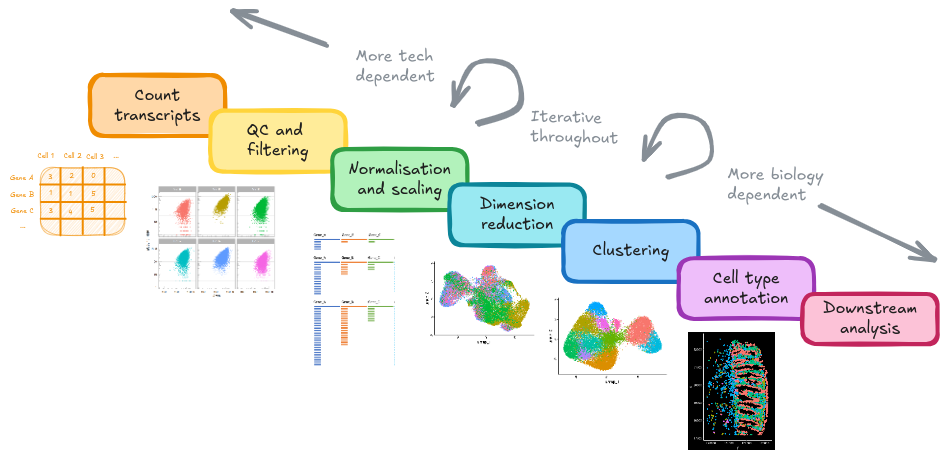
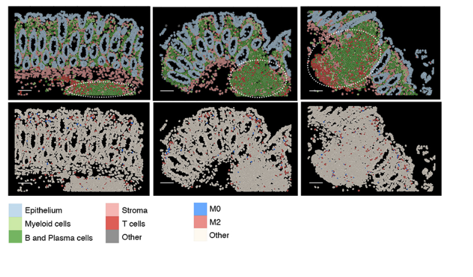

# Spatially Restricted Genes {#SpatiallyRestrictedGenes}

{width=100%}

<!--
Requires packages:
* Rfast2
* ape
-->

```{r message=FALSE, warning=FALSE}
library(tidyverse)
library(Seurat)
library(DT)
```

```{r message=FALSE, warning=FALSE, echo=FALSE}
#so <- readRDS("data/GSE234713_CosMx_IBD_seurat_01_preprocessed_subsampled.RDS" )
```

What genes have a spatially restricted expression across the tissue? These might be localised to a particular region and indicate some spatial activity.

We can calculate 'spatial autocorrelation' with the MoransI test to find them. 


## Run MoransI once

To run this quickly, going to arbitrarily reduce the number of variable features to just 15. In real life, we might pick all our VariableFeatures.


```{r message=FALSE, warning=FALSE}
so <- FindVariableFeatures(so, nfeatures=15)
```


First lets run it for a single sample by subsetting the object.

```{r message=FALSE, warning=FALSE}
the_sample <- 'CD_a'
the_fov    <- 'GSM7473688.CD.a'
so_sample  <- subset(so, tissue_sample == the_sample)
```  


There's a current bug ([see ticket](https://github.com/satijalab/seurat/issues/10099)) with the FindSpatiallyVariableFeatures function with this kind of data. We should be able to run it directly on the seurat object itself, but as a workaround, we will run it on the 'RNA' assay. 

```{r message=FALSE, warning=FALSE}
# If the Seurat method above crashes (segfault), a workaround is
# running FindSpatiallyVariableFeatures at the assay level
so_sample_assay <- so_sample[['RNA']]
tc <- GetTissueCoordinates(so_sample)
rownames(tc)<- tc$cell # the innards of findSpatiallyVariableFeatures expect rownames, but they're not there. Add them.

# When given an 'assay' FindSpatiallyVariableFeatures returns an assay. Put it back in the seurat object
so_sample[['RNA']] <- FindSpatiallyVariableFeatures(
  so_sample_assay,
  layer = "scale.data",
  spatial.location = tc, # now with rownnames
  features = VariableFeatures(so_sample)[1:15], # Just a few for testing
  selection.method = "moransi",
  nfeatures=10 # mark top 10 spatially variable
)
```


The results end up in the gene level metadata. Pull them out, but only display the genes we ran. 

```{r message=FALSE, warning=FALSE}
#Put feature name as a column in the feature metadata
so_sample[["RNA"]]@meta.data$feature <-rownames(so_sample[["RNA"]])
gene_metadata <- so_sample[["RNA"]]@meta.data

gene_metadata_morans <- 
  filter(gene_metadata, !is.na(moransi.spatially.variable.rank)) %>%
  select(feature, 
         MoransI_observed, MoransI_p.value, moransi.spatially.variable,moransi.spatially.variable.rank) %>% 
  arrange(moransi.spatially.variable.rank)
  
DT::datatable(gene_metadata_morans, width = '100%')

```

What do some of these genes look like on the tissue? How can we interpret this?

```{r message=FALSE, warning=FALSE}
ImageDimPlot(so_sample, 
             molecules = 'IGHA1', 
             group.by = 'tissue_sample', cols = c("grey30"), # Make all cells grey.
             boundaries = "segmentation",
             border.color = NA, axes = T, crop=TRUE) + ggtitle(the_sample)

ImageDimPlot(so_sample, 
             molecules = 'AQP8', 
             group.by = 'tissue_sample', cols = c("grey30"), # Make all cells grey.
             boundaries = "segmentation",
             border.color = NA, axes = T, crop=TRUE)+ ggtitle(the_sample)

ImageDimPlot(so_sample, 
             molecules = 'KRT20', 
             group.by = 'tissue_sample', cols = c("grey30"), # Make all cells grey.
             boundaries = "segmentation",
             border.color = NA, axes = T, crop=TRUE)+ ggtitle(the_sample)

```


## Run MoransI on all samples

Could it be that the expression pattern of a gene is disrupted? Is there a difference between samples or between groups?

Lets run the test on every sample. This is slow, For 15 genes on our 6 small subsetted samples it takes 2-3minutes. 

For real life, it could be parallelised and/or run overnight.

```{r message=FALSE, warning=FALSE}

# Record moransI results for each sample, one by one.
samples <- unique(so@meta.data$tissue_sample)
results_list <- list()
for (the_sample in samples) {
  
  so.sample <- subset( so, subset= tissue_sample == the_sample)

  so.sample.assay <- so.sample[['RNA']]
  tc <- GetTissueCoordinates(so.sample)
  rownames(tc)<- tc$cell
  # When given an 'assay' FindSpatiallyVariableFeatures returns an assay. Put it back in the seurat object.
  so.sample[['RNA']] <- FindSpatiallyVariableFeatures(
    so.sample.assay,
    layer = "scale.data",
    spatial.location = tc,
    features = VariableFeatures(so.sample),
    selection.method = "moransi",
    nfeatures=15 # mark top 10 spatially variable
    )
  # --- end workaround
  
  
  # Format output table
  so.sample[["RNA"]]@meta.data$feature <- rownames(so.sample[["RNA"]])
  gene_metadata <- so.sample[["RNA"]]@meta.data
  results <- 
  select(gene_metadata, 
         feature, 
         MoransI_observed, 
         MoransI_p.value, 
         moransi.spatially.variable,
         moransi.spatially.variable.rank) %>% 
    filter(!is.na(moransi.spatially.variable.rank)) %>% # only tested
    arrange(moransi.spatially.variable.rank) %>%
    mutate(sample = the_sample) %>%
    select(sample, everything())

  
  results_list[[the_sample]] <- results
}

# Collect output result 
results_all <- bind_rows(results_list)


# Add group by deleting pulling out the sample name with everything after _ deleted.
results_all$group <- gsub("_.*","", results_all$sample)

```


Lets visualise our MoransI scores for each gene for each sample on a boxplot. Note that this isn't an established standard way of interpreting these scores, but it does give us a way to prioritise what to look at.


MoransI scores are between -1 (anticorrelated) and 1 (perfectly correlated) - 0 is random. The baseline isn't 0 - probably because the observations are already limited to the tissue. But there's still clearly some genes with higher scores than others, even though the variation between samples is quite high.


```{r fig.width=10}
# unique set of genes that were top 10 morans in any sample
plot_genes <- filter(results_all, moransi.spatially.variable.rank <= 10) %>% pull(feature) %>% unique()
ggplot(filter(results_all, feature %in% plot_genes), aes(x=feature, y=MoransI_observed)) +
  geom_boxplot() +
  geom_point( mapping=aes(col=sample)) +
  theme_bw() +
  ggtitle("MoransI Per sample") +
  facet_wrap(~group, ncol=1)
```


## Explore moransI results

That doesn't mean much in isolation, so lets look at the actual distribution of some of those.


```{r message=FALSE, warning=FALSE}
so.CD_a <- subset( so, subset= tissue_sample == 'CD_a')
so.HC_a <- subset( so, subset= tissue_sample == 'HC_a')

```

IGKC has high autocorrelation all over

```{r message=FALSE, warning=FALSE}
p1 <- ImageDimPlot(so.CD_a, 
             molecules = 'IGKC', 
             group.by = 'tissue_sample', cols = c("grey30"), # Make all cells grey.
             boundaries = "segmentation", border.color = NA, axes = T, crop=TRUE)
p2 <- ImageDimPlot(so.HC_a, 
             molecules = 'IGKC', 
             group.by = 'tissue_sample', cols = c("grey30"), # Make all cells grey.
             boundaries = "segmentation", border.color = NA, axes = T, crop=TRUE)
p1 + p2 
```


Contrast that with a CHGA - still a highly variable gene, with a low(er) spatial autocorrelation
```{r message=FALSE, warning=FALSE}
p1 <- ImageDimPlot(so.CD_a, 
             molecules = 'CHGA', 
             group.by = 'tissue_sample', cols = c("grey30"), # Make all cells grey.
             boundaries = "segmentation", border.color = NA, axes = T, crop=TRUE)
p2 <- ImageDimPlot(so.HC_a, 
             molecules = 'CHGA', 
             group.by = 'tissue_sample', cols = c("grey30"), # Make all cells grey.
             boundaries = "segmentation", border.color = NA, axes = T, crop=TRUE)
p1 + p2 
```


CCL21 has a combination of high and low scores. Why?

```{r message=FALSE, warning=FALSE}
p1 <- ImageDimPlot(so.CD_a, 
             molecules = 'CCL21', 
             group.by = 'tissue_sample', cols = c("grey30"), # Make all cells grey.
             boundaries = "segmentation", border.color = NA, axes = T, crop=TRUE)
p2 <- ImageDimPlot(so.HC_a, 
             molecules = 'CCL21', 
             group.by = 'tissue_sample', cols = c("grey30"), # Make all cells grey.
             boundaries = "segmentation", border.color = NA, axes = T, crop=TRUE)
p1 + p2 
```


There's a big clump of CCL21 at the bottom of HC_a, lets figure out which FOV that is and zoom in further. Now we can practically bring back the cluster labels.
```{r message=FALSE, warning=FALSE}
ImageDimPlot(so.HC_a, group.by = 'fov')

so.HC_a.4 <- subset(so.HC_a, fov==4)

ImageDimPlot(so.HC_a.4, 
             molecules  = 'CCL21', 
             group.by   = 'cluster_labels', alpha=0.3,# Show clusters, but faded 
             cols = 'polychrome',
             boundaries = "segmentation",  border.color = NA, axes = T, crop=TRUE) 
```


That seems to be because of a group of T cells expressing CCL21's. We can highlight those alongside our transcripts.
```{r message=FALSE, warning=FALSE}
so.HC_a.4$isT <- ifelse(so.HC_a.4$cluster_labels == "c5: T cell", "T cell", "Other")
ImageDimPlot(so.HC_a.4, 
             molecules  = 'CCL21', 
             group.by   = 'isT', alpha=0.3,# Show clusters, but faded 
             cols = c("T cell"="blue", 'Other'='grey80'),
             boundaries = "segmentation",  border.color = NA, axes = T, crop=TRUE) 
```


If we look at Garrido-Trigo et al's paper - they highlight these kind of lymphoid niches, full of T, B and plasma cells. They go on to look at macrophage subtypes within these regions across different conditions.

{width=100%}

In our case, these could be more formally defined by a niche-neighbourhood analysis; which at the most basic level, classifies each cell into a 'niche' depending on what type of cells are in its immediate vicinity. We could then analyse our data at the 'niche' level.


<!-- ## Co-occurrence tests? (Potential addition) -->

<!-- Try to test foc co-occurrence of CCL21 and cluster (or MS4A1) -->

<!-- Easiest way might be a conversion to SFE then use voyager as per the bivariate stats workflow: https://pachterlab.github.io/voyager/articles/bivariate.html -->


