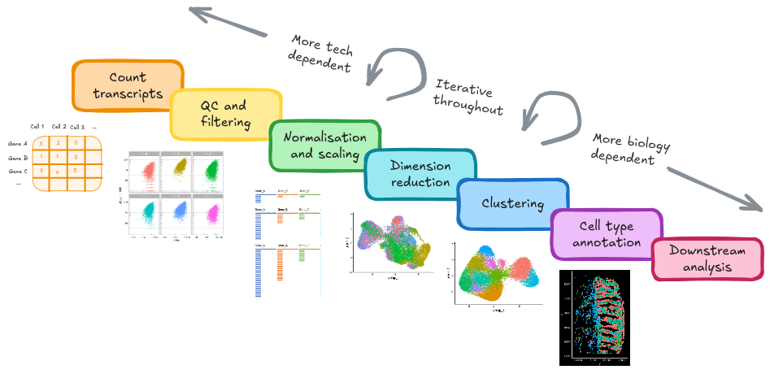

# Summary {#Summary}


{width=100%}

1. Loaded raw data outputs from a cosmx machine into a Seurat object for processing
2. Performed QC and filtering to carefully remove 'unwanted' cells of poor quality that might interfere with downstream analyses(low counts, or high negative background)
3. Normalised and scaled data to enable quanitfication of expression information and cell-cell trancriptional similarity
4. Produced a UMAP plot, and visualised our experimenal information and QC metrics
5. Identified and corrected for a sample-level batch effect
6. Clustered cells into clusters based on their transcriptional similarity
7. Identified specific gene markers for each cluster
8. Classified cells using a publically available reference dataset
9. Labelled celltypes
10. Identified spatially restricted genes
11. Copious visualisations


At this point in the analysis we could go in many directions, depending on our experimental aims. Some potential options are linked in the [next steps](#OtherTechniques) section.


Where we started:

| File name                         | Description                               |
|-----------------------------------|-------------------------------------------|
| `SLIDE-polygons.csv.gz`           | Cell borders                              |
| `SLIDE_exprMat_file.csv.gz`       | Counts of genes per cell (counts matrix)  |
| `SLIDE_fov_positions_file.csv.gz` | Location of FOVs on slide                 |
| `SLIDE_metadata_file.csv.gz`      | Cell-level QC metadata                    |
| `SLIDE_tx_file.csv.gz`            | Location of individual transcripts        |


Our processed object:

```{r  message=FALSE, warning=FALSE, echo=FALSE}
so_fov <- so[, so$tissue_sample=="HC_a" & so$fov==1]
ImageDimPlot(so_fov,
             fov          = "GSM7473682.HC.a",
             axes = TRUE,
             border.color = NA, border.size = 0.1,
             cols = 'polychrome', 
             group.by = "cluster_labels",
             boundaries   = "segmentation",
             crop=TRUE)

```
