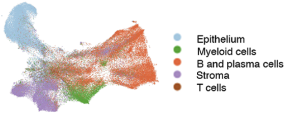
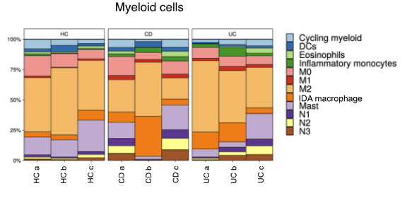
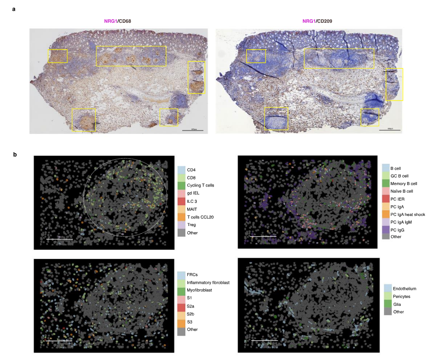

# Next steps{#NextSteps}

We've done a fairly streamlined preprocessing of a single cell spatial dataset. At this point in the analysis it would be time to drill into the biology and start doing some focussed analyses. What might be possible?

## What did the authors find from this dataset?

In their paper [Macrophage and neutrophil heterogeneity at single-cell spatial resolution in human inflammatory bowel disease](https://pubmed.ncbi.nlm.nih.gov/37495570/) Garrido-Trigo et al performed and extensive analysis of their cosmx Data alongside single cell, bulk and microscopy data. 
To summarise the kinds of things that are possible with single-cell spatial data - here is a list of some of the analyses from that paper that specifically use this spatial dataset;

* Identified their detailed celltypes in their single cell data (over the whole transcriptome), which they used to classify celltypes in their spatial data. They classified their data at broad and specific levels (page 2 - *Integration of single-cell RNA sequencing and spatial molecular imaging analysis provides a map of healthy and inflamed colon*, Figs 1b and part of Supp Fig 1b for epithelia)

{width=49%} {width=49%}

* Looked at differential abundance of celltypes across samples (page 2 - *Transcriptional analysis at single-cell and spatial resolution reveals different populations of resident and inflammatory macrophages in the colonic mucosa* )
* Identified cell niches with different neighbourhoods, e.g lymphoid structures, lamina propria and lower crypt. They quantified an increase in inflammatory celltypes in some of those neighbourhoods, and characterised another neighbourhood seen only in the IBD samples. (page 2 - *Integration of single-cell RNA sequencing and spatial molecular imaging analysis provides a map of healthy and inflamed colon*)

{width=100%}

* They observed granuloma features in one patient. They examined the macrophage subtypes within them and the surrounding immune cell microenvironment. (Figure 4b, page 6 _CosMx Spatial Molecular Imaging analysis confirms the expansion of Inflammation-Dependent Alternative macrophages and reveals their tissue distribution in inflammatory bowel disease colon_)

{width=100%}

* Identified a change in myeloid cell localisation by quantifying the distance of macrophage, MAST cells and Dendritic cells to the mucosal surface (page 2 - *Transcriptional analysis at single-cell and spatial resolution reveals different populations of resident and inflammatory macrophages in the colonic mucosa* )
* Observed spatially localised expression of a gene (NRG1) within a subset of apically-located fibroblasts (page 4 - _Inflammation-dependent alternative macrophages express neuregulin 1_)

## Other techniques.

### Imaging related

**Segmentation**

Good cell segmentation from images underpins downstream analysis. Different platforms offer inbuilt segmentation methods, and often require tweaking from the default with different tissues, antibodies or runs. 

* On-machine segmentation: e.g. Xenium/CosMx
* Directly from images using specialised microscopy methods for segmentation. e.g. CellPose
* Many more resources online...

**Image analysis**

* https://cellprofiler.org/ : One toolkit often used in traditional imaging for various tasks, e.g. cell morphology quantifications.
* Many more resources online...

**Image registration **

Especially for multiomics analysis, being able to align images of the same tissue from different sources is essential. E.g. H&E, immunofluorescence, proteomics e.t.c

* https://lmweber.org/OSTA/pages/crs-spatial-registration.html : Image registration, for aligning images from different sources. E.g. H&E, immunofluorescence, proteomics e.t.c
* Many more resources online...

**Sample and Regional Annotation**

It's typical to have multiple samples on a single slide. We need to label each cell with its ID. Similarly you might want to outline a particular region.

* Define samples by their centroid x-y coordinates (Painstaking, but it can be enough)
* Vendor-based solutions; e.g. regional highlighting with [Xenium explorer](https://www.10xgenomics.com/support/software/xenium-explorer/latest/tutorials/xe-selecting-multiple-regions-of-interest)
* Import masks from annotated images
* Do you know better approaches or tools? Please share.

### Downtream annotation and analyses

**Niche analysis**

Cell 'niche' analysis or 'spatial context' is a major avenue of in situ spatial analyses. E.g. tumour microenvrionments, tissue regions. The actual definition of what a 'niche' is could be considered flexible - it depends on what you are trying to achieve - and different tools take differnt approches.

* Seurat findNiches()
* OSCA neighbourhood analyses: https://lmweber.org/OSTA/pages/img-neighbourhood-analysis.html
* hoodscanR : https://www.bioconductor.org/packages/release/bioc/vignettes/hoodscanR/inst/doc/Quick_start.html
* GraphST : https://www.nature.com/articles/s41467-023-36796-3 
* Many more ...

**'Spatial' pattern tests and cell free analyses**

Huge area of research, here are some starting points;

* Co-localisation and differential co-localisation: https://lmweber.org/OSTA/pages/mult-diff-spatial-patterns.html
* Statial toolkit (Kontextual and Spatiomark) for quantifying spatial relationhips and expression with spatial contet: [Statial package](https://bioconductor.org/packages/release/bioc/html/Statial.html) 
* Spatial tests, adapted form geospatial methods:  https://pachterlab.github.io/voyager/
* Molecule level data object (not a SingleCellExperiment): https://www.bioconductor.org/packages/release/bioc/html/MoleculeExperiment.html
* Many more ...

**Differential expression**

Though current gen single-cell spatial techonlogies have lower counts and fewer genes in a panel than single cell (and bulk) studies, being able to test for differences in gene expression is valuable; potentially within a celltype, niche or spatial region that couldn't be isolated with other technologies. With this in mind, single cell methods can be applied.

* Differential expression in scRNAseq (bioconductor): https://bioconductor.org/books/3.21/OSCA.multisample/multi-sample-comparisons.html
* Applied example (in this same dataset!) running differential expresison at the celltype level using [Seurat](https://swbioinf.github.io/spatialsnippets/e_DEPseudobulkSampleLevel_insitu.html#Overview) or [bioconductor ecosystem](https://swbioinf.github.io/spatialsnippets/e_DEPseudobulk_insitu_sfe.html)
* Spatially-aware differential expression methods; These are emerging quickly, consider looking into [Differential gene expression analysis of spatial transcriptomic experiments using spatial mixed models](https://www.nature.com/articles/s41598-024-61758-0) and [spacexr](https://github.com/dmcable/spacexr)
* Many more ...

**Differential abundance**

Differences in the numbers or types of cell in a particular location or neighbour niche between groups can indicate biological differences; from cell migration, expansion or development.

* Propeller for testing celltype proportion changes: https://github.com/phipsonlab/speckle
* Many more ...

**Multiomics**

Another huge area of research, here are some starting points. It very much depends on which multiomics you have.

* Seurat multimodal vignette (single cell):  https://satijalab.org/seurat/articles/multimodal_vignette (single cell)
* Image registration, for aligning images from different sources. E.g. H&E, immunofluorescence, proteomics e.t.c : https://lmweber.org/OSTA/pages/crs-spatial-registration.html
* Many more ...

### Visualisation

There are many tools out there, each with strengths and limitations.

* VRomics: https://ramialison-lab.github.io/pages/vromics.html
* Xenium explorer (Xenium only): https://www.10xgenomics.com/support/software/xenium-explorer/latest
* AtoMx (cosmx only) : https://nanostring.com/products/atomx-spatial-informatics-platform/atomx-sip-overview/
* Napari [cosmx guide](https://nanostring-biostats.github.io/CosMx-Analysis-Scratch-Space/posts/napari-cosmx-basics/using-napari-cosmx.html)
* CellXGene (single cell) : https://cellxgene.cziscience.com/
* iSEE (single cell): https://github.com/iSEE/iSEE
* Many more ...
